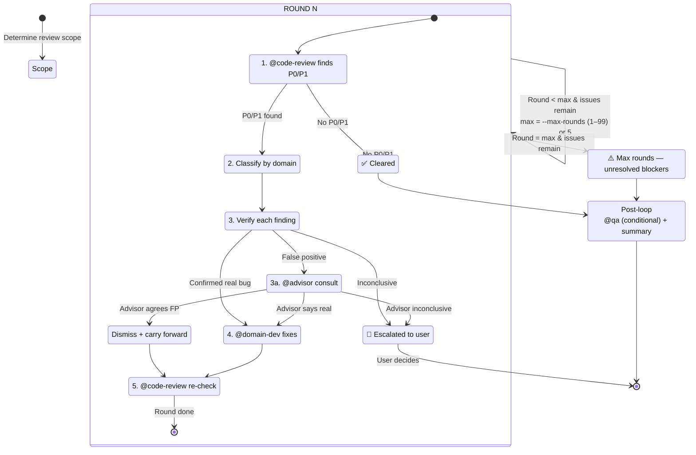

$ARGUMENTS

**Arguments:**
- Positional arg (optional): review scope — `last commit`, `HEAD~N`, `branch`, `PR`, or empty (uncommitted changes).
- `--max-rounds=N` (optional): override the maximum number of iterations. Default: 5, range 1–99. Increase for large cross-module diffs (e.g., `--max-rounds=8`); decrease for quick single-file reviews (e.g., `--max-rounds=3`).

**Examples:**
```
/review-fix-loop                          # review uncommitted changes, default 5 rounds
/review-fix-loop last commit              # review HEAD~1 diff
/review-fix-loop HEAD~3                   # review last 3 commits
/review-fix-loop --max-rounds=8           # large cross-module diff, allow 8 rounds
/review-fix-loop main                     # review current branch vs main
```

## When to use (and when NOT to)

**Use this command** for any code change that has P0/P1 potential — feature diffs, bug fixes, refactors, migrations.

**Do NOT use this command** for:
- Style-only / formatting-only changes → run `@code-review` directly.
- Documentation-only diffs → run `@code-review` directly.
- Single-trivial nit fixes → fix directly, skip the loop.
- You only want a review report with no fixes → run `@code-review` directly.

## Graph



**Loop invariant (carried forward every iteration):**
- Prior fixes applied (so `@code-review` doesn't re-report them)
- Dismissed false positives + advisor concurrence + reasons (so `@code-review` doesn't re-report them)
- Round counter (1–max, default 5, cap 99)

**Exit conditions (exactly one fires per loop):**

| Exit | Condition | Next action |
|---|---|---|
| ✅ Cleared | `@code-review` reports no P0/P1 | Post-loop → `@qa` (conditional) + summary |
| ⚠️ Max rounds | Max rounds exhausted (default 5, range 1–99 via `--max-rounds`), P0/P1 remain | Post-loop → summary with unresolved blockers |
| 🔴 Escalated | Verification or advisor inconclusive | Stop — user decides with evidence |

## Determining review scope

Parse `$ARGUMENTS` to determine scope (positional arg) and max rounds (`--max-rounds=N`), then apply the rules below:

1. **If the user specified a commit/branch/PR** → review that specific change set. Use `git diff`, `git log`, `git show` to identify changed files.
2. **If the user said "latest commit"** → run `git log -1` and `git diff HEAD~1` to find the changes.
3. **If nothing specific** → run `git status` and `git diff` to discover uncommitted changes.
4. **If still unclear** → ask the user one focused question to clarify scope.

## The loop

### Maximum iterations: 5 rounds (default, configurable via `--max-rounds=N`, range 1–99)

The loop runs at most 5 rounds by default. If `--max-rounds=N` was specified, use N instead (clamped to 1–99). If P0/P1 issues remain after max rounds, stop and report.

**Parsing `--max-rounds`:** parse as integer; non-numeric, empty, or missing value → fall back to default 5. Then clamp to [1, 99]. Example: `--max-rounds=0` → 1; `--max-rounds=abc` → 5; `--max-rounds=150` → 99.

**When to increase:** large cross-module diffs (>20 files), microservice changes touching 3+ services, or schema migrations with cascading code changes. Use `--max-rounds=8`.
**When to decrease:** single-file hotfix, config-only changes. Use `--max-rounds=3`.

### Round structure

Each round consists of 5 steps. **Every P0/P1 finding must pass through Verify before any fix is dispatched — no exceptions.**

#### Step 1 — Review

Dispatch to `@code-review` with the current change set and any context from previous rounds.

#### Step 2 — Triage

If P0/P1 issues are found, classify each by domain. **Dispatch based on the language/domain of the file where the finding is located**, NOT the repository's primary language — a Java repo may have Python scripts, and a bug in a `.py` file goes to `@python-dev`.

**Domain classification (check in order — first match wins):**

1. **Security / auth / injection / secret handling** → `@security` first for assessment, then hand off to the language-specific dev for the actual fix. If the finding is a pure code bug that *happens* to have security implications (e.g., missing input validation that causes a crash, not an exploit), skip `@security` and dispatch to the language dev directly.
2. **Database / SQL / migration / query** → `@dba`.
3. **DevOps / deployment / CI / Docker / infra** → `@devops`.
4. **Frontend / UI / component / CSS** → `@frontend-dev`.
5. **Backend / API / service logic** → choose by **the finding's file extension/language**:
   - `.java` → `@java-dev`
   - `.py` → `@python-dev`
   - `.go` → `@go-dev`
   - `.rs` → `@rust-dev`
   - `.ts`/`.js`/`.mts`/`.mjs`/`.cts`/`.cjs` → `@node-dev`
   - Other languages not listed → dispatch to the closest matching dev agent based on ecosystem similarity. If truly unclassifiable, escalate to the user.
6. **Fallback — none of the above** (e.g., shell script, Makefile, proto, config YAML with no clear domain): escalate to the user with the finding + a recommendation for which agent is closest.

**Cross-domain priority rule:** when a finding matches multiple domains, apply this priority:
- Security-critical findings (injection, auth bypass, secret leak) → `@security` assesses first, then language dev fixes.
- Data-integrity findings (SQL, migration, data loss) → `@dba` assesses first, then language dev fixes.
- All other findings → dispatch to the language/domain dev directly.

#### Step 3 — Verify (gate before fix)

Before dispatching any fix, **independently verify** that each P0/P1 finding is a real bug. This is a hard gate — no fix may proceed without passing it.

Verification checklist (all four must be checked):

1. **Read the actual source code** at the reported `file:line` — confirm the code matches the finding's description.
2. **Trace the data flow / call path** — confirm the issue is reachable and triggerable, not dead code or guarded by an upstream check.
3. **Check surrounding context** (callers, tests, config) — confirm the issue isn't already handled elsewhere or mitigated by an existing guard.
4. **Check if the reported behavior is intentional** (e.g., a deliberate design choice, a documented exception, a test assertion).

Based on the verification result, follow exactly one branch below:

**Branch A — Confirmed real bug** (verifier agrees with `@code-review`):
→ Proceed directly to Step 4 (Fix). Both parties agree, no third opinion needed.

**Branch B — False positive** (verifier disagrees with `@code-review`):
→ **Do NOT dismiss unilaterally.** Dispatch to `@advisor` for an independent second opinion (see Step 3a below). The finding can only be dismissed if `@advisor` agrees it's a false positive. If `@advisor` disagrees, treat as confirmed real and proceed to Fix. If `@advisor` is inconclusive, escalate to the user.

**Branch C — Inconclusive** (verifier can't determine either way):
→ Escalate to the user with the evidence collected. Do NOT fix speculatively. Do NOT dispatch to `@advisor` — the advisor needs a concrete position to evaluate, and "I don't know" doesn't provide one.

#### Step 3a — Advisor consultation (only when verifier says false positive)

When verification concludes a finding is a false positive, consult `@advisor` before deciding to skip the fix. This prevents a single party (the verifier) from unilaterally overriding `@code-review`'s finding.

Dispatch to `@advisor` with:
- The original finding from `@code-review` (file:line, problem description, severity).
- The verifier's evidence for why it's a false positive (data flow traced, guards found, intentional behavior, etc.).
- Ask: "Is this finding a real bug that must be fixed, or a false positive that can be safely dismissed?"

`@advisor` returns one of three opinions:

| Advisor says | Action | Rationale |
|---|---|---|
| **Agrees — false positive** | Dismiss the finding. Log it with the reason + advisor's concurrence. Carry forward to next `@code-review` dispatch. | 2 of 3 parties agree it's not a bug. |
| **Disagrees — real bug** | Proceed to Step 4 (Fix). Include both `@code-review`'s finding and `@advisor`'s counter-argument in the fix dispatch. | 2 of 3 parties say it's real. |
| **Inconclusive** | Escalate to the user with all evidence from both sides. | No consensus — human decides. |

**One call per finding.** Don't loop with the advisor. If the advisor is unavailable (advisor mode off), the finding defaults to **kept as real** — proceed to Fix. Never silently dismiss a finding that `@code-review` raised just because the verifier disagreed.

#### Step 4 — Fix

Dispatch to the matching specialist for each **verified** P0/P1 issue. Provide the specific finding, file:line reference, verification conclusion, and the fix suggestion from the review. Fix ONLY blocking issues — leave P2/P3 for later.

**Batching rule:** multiple verified findings in the **same file** routed to the **same agent** may be batched into a single dispatch (include all findings in the prompt). Findings in different files or different agents must be dispatched separately.

**Parallel dispatch:** findings routed to **different agents** (e.g., a `.java` fix to `@java-dev` and a `.py` fix to `@python-dev`) MAY be dispatched in parallel — they touch independent files and have no ordering dependency. Batched findings within the same agent remain a single sequential dispatch.

#### Step 5 — Re-review

Dispatch to `@code-review` again on the updated changes. Carry forward all dismissed findings (with reasons) so they aren't re-reported.

The re-review must check two things:
1. **Regression check** — are previously fixed issues still fixed? If a fix was reverted or broken by a subsequent fix, flag it as a regression P0.
2. **New-issue check** — did any fix introduce a NEW P0/P1? If so:
   - If the new issue is in the same file and can be fixed within the same round → dispatch a follow-up fix immediately (does not consume a new round).
   - If the new issue is critical and can't be resolved within the same round → stop and escalate to the user with the original fix + the new issue.

### Agent failure handling

If any dispatched agent fails (timeout, error, incomplete output) during a round:

1. **Retry once** with the same dispatch + a note that the previous attempt failed. Do not retry more than once — repeated failures indicate a systemic issue.
2. **If retry fails** → escalate to the user with the failure reason, the finding that was being processed, and the agent that failed. Do not skip the finding silently.
3. **If `@code-review` fails** during Step 1 or Step 5 → the round cannot proceed. Escalate to the user with the partial results from prior rounds.
4. **If `@advisor` fails** (Step 3a) → the finding defaults to **kept as real** (same as advisor mode off). Proceed to Fix. Log that advisor was unavailable.

### Stop conditions

- **Stop immediately** when `@code-review` reports no P0/P1 issues.
- **Stop** after max rounds (default 5, range 1–99 via `--max-rounds`), even if P0/P1 issues remain — report them as unresolved blockers.
- **Stop** if a fix introduces a new critical issue that can't be resolved within the same round — escalate to the user.

### Post-loop

Once the loop exits (cleared or max rounds reached):

1. **@qa dispatch (conditional):** dispatch `@qa` for regression test recommendations IF the diff touched critical paths (auth, payment, data-mutation, schema migration) OR the total fix count ≥ 3. Otherwise skip `@qa` — the re-review already validated correctness.
2. Summarize the full loop (see Output format below).

## Dispatching guidelines

When dispatching to `@code-review`:
```
@code-review

Context: Review round N of the review-fix-loop. Previous rounds found and fixed: <summary of prior fixes>. Previously dismissed as false positive (do NOT re-report): <list with reasons>.
Task: Review the following changes for P0/P1 issues only. Focus on correctness, security, and data integrity.
Scope: <files/commits to review>
Expected output: Severity-ranked findings list with file:line references and concrete fix suggestions.
```

When dispatching to `@advisor` (false-positive consultation):
```
@advisor

Context: Review-fix-loop round N. @code-review raised the following P0/P1 finding, but independent verification concluded it is a false positive. I need your independent opinion before dismissing it.

  Finding: `<file>:<line>` — <problem description from @code-review>. Suggested fix: <suggestion>.
  Verifier's evidence (why it's a false positive):
    - <evidence point 1: e.g., "data flow traced — input is sanitized at line X before reaching this point">
    - <evidence point 2: e.g., "caller at line Y already guards against this condition">
    - <evidence point N: ...>

Question: Is this finding a real bug that must be fixed, or a false positive that can be safely dismissed?
Expected output: One of — "Agree: false positive" / "Disagree: real bug" / "Inconclusive", with a one-paragraph rationale.
```

When dispatching to a specialist for a fix:
```
@<domain-dev>

Context: Review-fix-loop round N. @code-review found the following P0/P1 issue(s):
  - `<file>:<line>` — <problem description>. Suggested fix: <suggestion>.
  [<If batched:> - `<file>:<line>` — <problem description>. Suggested fix: <suggestion>.]
  Verification: Confirmed real bug. <evidence: data flow / call path / why existing guards don't cover it>.
  [<If advisor was consulted because verifier initially said false positive:> @advisor was consulted and agreed this is a real bug. Advisor's rationale: <rationale>.]
Task: Apply a minimal, targeted fix for each issue above. Do not refactor or change unrelated code.
Constraints: Keep the fix minimal. Do not introduce new patterns or dependencies.
Expected output: The fix applied, with a brief explanation of what changed and why.
```

## Hard rules

- **Carry context forward** — pass prior round findings (including dismissed false positives + advisor concurrence, and their reasons) to the next `@code-review` dispatch so it doesn't re-report fixed or dismissed issues.
- **Fix only verified P0/P1 issues** — do not fix P2/P3/nits unless they directly block the review loop. Collect P2/P3 findings reported by `@code-review` and list them in the final summary under "Recommended next steps" — do not silently drop them.
- **Do not stop after the first review** if blocking issues remain — that defeats the purpose of the loop.
- **Prefer minimal, targeted fixes** — one issue, one fix. No drive-by refactoring.
- **Escalate when stuck** — if a fix can't be applied without user input (e.g., ambiguous requirement, breaking change), stop and ask the user.

## Output format

### Per-round output

```
### Review Round N
- Findings: <P0 count>P0, <P1 count>P1, <P2+ count>P2+
- Verified: <count> confirmed real, <count> false positive → advisor consulted
  - Of false positives: <count> advisor agreed (dismissed), <count> advisor disagreed (fixed), <count> inconclusive (escalated)
- Fixes applied: <list of files changed and what was fixed>
- Dismissed: <list of findings dismissed as false positive, with advisor concurrence + reason>
- Regressions: <count> previously-fixed issues regressed (if any)
- Remaining blockers: <yes/no> — <count> P0/P1 issues remain
```

### Final summary

```
## Review-Fix Loop Summary

**Verdict: <Cleared | Remaining blockers>**

### Loop statistics
- Rounds completed: <N>
- Issues found: <total>
- Issues verified as real: <count>
- Issues dismissed as false positive (with advisor concurrence): <count>
- Issues escalated to user: <count>
- Issues fixed: <count>
- Regressions caught: <count>
- Issues remaining: <count>

### Fixed issues
- `path/to/file.ts:42` — <issue> → <fix applied>

### Dismissed issues (false positive — advisor concurred)
- `path/to/file.ts:15` — <issue> — <why dismissed> — <advisor rationale>

### Remaining issues (if any)
- `path/to/file.ts:15` — <issue> — <why it wasn't fixed>

### Recommended next steps
- <regression test / follow-up / escalate>
```
