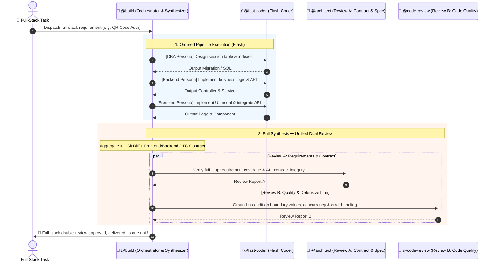

# Three-Tier Dev Loops (`/quick-dev` & `/fast-dev` & `/deep-dev`)

Three-Tier Dev Loops represent the flagship multi-agent workflow system in OpenCode's production engineering configuration.

By pioneering the synergy of **"Ultra-fast Flash Model Coding ➕ Flagship Dual-Review PUA Audit ➕ Dynamic Domain Persona Injection ➕ Consensus Arbitration"**, it delivers a structured continuum from **Zero-Review direct delivery** to **Single-Review agile loop** to **Dual-Review deep consensus**, achieving **3x faster velocity, an 80% reduction in token costs, and uncompromising production code quality**.

---

## 1. Why Three-Tier Dev Loops?

Traditional AI-assisted coding typically suffers from two core dilemmas:
1. **Expensive Single-Turn Coding**: Using flagship models directly to write large volumes of boilerplate code is slow and costly;
2. **Single-Reviewer Blind Spots vs. Review Overhead**: A single reviewer may miss architectural regressions, but enforcing multi-turn review for simple scripts or quick prototypes creates unnecessary friction.

Three-Tier Dev Loops completely decouple **Execution/Writing (high-throughput task)** from **Quality & Verification (high-reasoning task)** across 3 customizable tiers:

```
                ┌──────────────────────────────────────────────────────────┐
                │                     User Requirement                     │
                └──────────────────────────┬───────────────────────────────┘
                                           │
        ┌──────────────────────────────────┼──────────────────────────────────┐
        │                                  │                                  │
  ⚡ /quick-dev                      🚀 /fast-dev                       🧠 /deep-dev
【Zero-Review (Direct Output)】      【Agile Single-Review (Daily)】    【Mission-Critical Dual-Review】
        │                                  │                                  │
┌───────┴───────┐                  ┌───────┴───────┐                  ┌───────┴───────┐
│• Passthrough  │                  │• Passthrough  │                  │• Passthrough  │
│• Coding: Flash│                  │• Coding: Flash│                  │• Coding: Flash│
│• Review: None │                  │• Review: Single│                 │• Review A: Architect│
│• Exit: Instant│                  │• Rounds: Max 10│                 │• Review B: Security│
│               │                  │• Exit: Approve│                  │• Arbitrate: Advisor│
│               │                  │               │                  │• Exit: Consensus│
└───────────────┘                  └───────────────┘                  └───────────────┘
```

---

## 2. Comparison & Selection Matrix

| Dimension | ⚡ `/quick-dev` (Quick Track) | 🚀 `/fast-dev` (Fast Track) | 🧠 `/deep-dev` (Deep Track) |
| :--- | :--- | :--- | :--- |
| **Use Cases** | Throwaway scripts, UI tweaks, quick prototyping, human-only reviews | 80% of daily tasks: CRUD endpoints, UI components, single-module refactoring | 20% mission-critical tasks: Payments, auth & security, distributed transactions, full-stack |
| **Coder Agent** | **Direct `@code` in-session (Zero dispatch overhead)** | Flash / Fast model (`@fast-coder` dispatch, mapped to `flash` tier) | Flash / Fast model (`@fast-coder` dispatch, mapped to `flash` tier) |
| **Review Team** | ❌ **None (Bypassed)** | ⚖️ 1 Flagship Reviewer (`@code-review`) | 🏛️ **2 Flagship Reviewers (`@architect` ➕ `@code-review`)** |
| **Consensus & Arbitration** | None | Direct iterative fixes | **Disagreements trigger `@advisor` arbitration under Safety-First principles** |
| **Review Standards** | Basic syntax correctness | Strict lint, correct types, no regressions | **Deep requirement traceability, contract verification, PUA-grade boundary checks** |
| **Convergence** | **1 Round (Instant)** | Max 10 rounds (typically settles in 2–3 rounds) | Max 10 rounds (typically settles in 3–5 rounds) |

---

## 3. Dynamic Domain Persona Injection

A common question is: *"How does a single `@fast-coder` master specialized practices across Frontend, Go, Python, and DBA?"*

The system implements **Dynamic Domain Persona Injection**:
1. **Stateless Container**: `@fast-coder` is bound to the fast Flash/Lite model tier, maintaining maximum throughput and responsiveness;
2. **On-the-Fly Persona Enchantment**: Orchestrator `@build` detects the technical stack and injects specialized domain guidelines into the prompt header:
   - **Frontend**: Strict TS (no `any`), atomic Tailwind, no wasteful re-renders, A11y standards;
   - **Go**: Explicit error handling, context propagation, goroutine leak prevention, zero panics in hot paths;
   - **Python**: Pydantic/Type Hints, `asyncio` concurrency, `with` resource cleanup, PEP8;
   - **DBA**: Leftmost prefix index matching, non-blocking migrations, parameterized queries;
3. **Parallel Multirole Execution**: Subagents operate in isolated sessions, allowing `@build` to dispatch multiple `@fast-coder` instances in parallel (e.g. Frontend + Backend concurrently).

---

## 4. Full-Stack Multi-Stage Orchestration

For complex tasks spanning database migrations, backend APIs, and frontend UIs, `/deep-dev` handles end-to-end decomposition and synthesis:



---

## 5. Usage & Arguments

### 1. `/quick-dev` (Zero-Review High-Velocity Track)

```bash
# Instant script generation or straightforward UI tweak (bypasses all AI reviews)
/quick-dev Add copy button to code blocks with toast feedback

# Alias command (equivalent)
/flash-dev Fix off-by-one error in pagination query
```

### 2. `/fast-dev` (Agile Single-Review Track)

```bash
# General features & component development (1 flagship reviewer)
/fast-dev Implement user avatar upload and crop component

# Custom max rounds
/fast-dev Optimize order pagination query and add composite index --max-rounds=5
```

### 3. `/deep-dev` (Mission-Critical & Full-Stack Track)

```bash
# Mission-critical refactoring
/deep-dev Refactor settlement engine with distributed transaction compensation

# Full-stack feature (auto DB ➡️ Backend ➡️ Frontend staging & synthesis)
/deep-dev Implement QR-code login: session table schema, polling backend API, and frontend dialog component --max-rounds=10
```

---

## 6. Guardrails & Anti-Lock Mechanism

1. **Safety-First Principle**: When Reviewer A and Reviewer B disagree, `@advisor` arbitration strictly enforces the stricter requirement;
2. **10-Round Fuse Guard**: If unresolved issues remain after 10 rounds, the loop automatically halts and produces an **Unresolved Conflict Report** for human review;
3. **Zero Configuration Pollution**: [tiers.json](file:///d:/OpenHub/opencode-config/tiers.json) seamlessly connects with `/profile` across all model providers.
