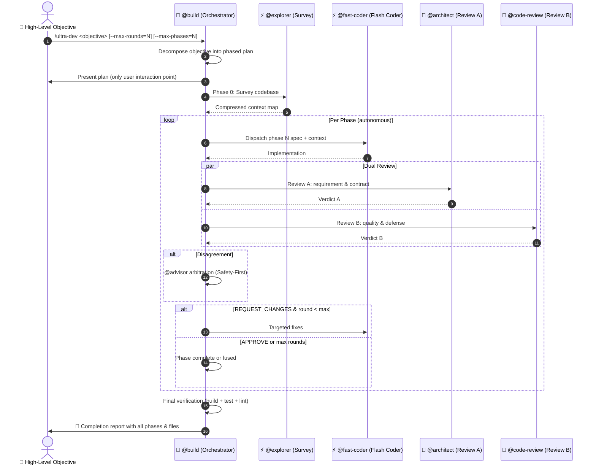
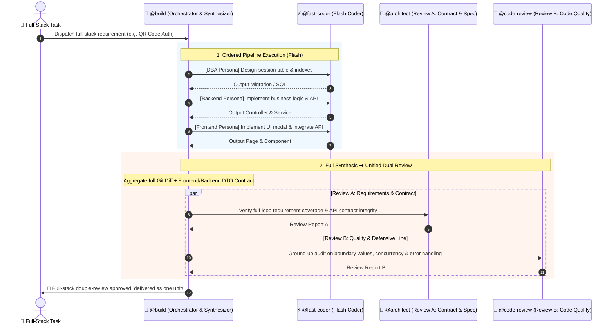

# Four-Tier Dev Loops (`/quick-dev` & `/fast-dev` & `/deep-dev` & `/ultra-dev`)

Four-Tier Dev Loops represent the flagship multi-agent workflow system in OpenCode's production engineering configuration.

By pioneering the synergy of **"Ultra-fast Flash Model Coding ➕ Evidence-Driven Dual-Review Audit ➕ Dynamic Domain Persona Injection ➕ Consensus Arbitration ➕ Autonomous Goal-Driven Execution"**, it delivers a structured continuum from **Zero-Review direct delivery** to **Single-Review agile loop** to **Dual-Review deep consensus** to **Autonomous multi-phase execution**, achieving **3x faster velocity, an 80% reduction in token costs, and uncompromising production code quality**.

---

## 1. Why Four-Tier Dev Loops?

Traditional AI-assisted coding typically suffers from two core dilemmas:
1. **Expensive Single-Turn Coding**: Using flagship models directly to write large volumes of boilerplate code is slow and costly;
2. **Single-Reviewer Blind Spots vs. Review Overhead**: A single reviewer may miss architectural regressions, but enforcing multi-turn review for simple scripts or quick prototypes creates unnecessary friction.

Four-Tier Dev Loops completely decouple **Execution/Writing (high-throughput task)** from **Quality & Verification (high-reasoning task)** across 4 customizable tiers — from zero-review instant delivery to fully autonomous multi-phase execution:

```
                ┌──────────────────────────────────────────────────────────────────────┐
                │                          User Requirement                              │
                └──────────────────────────────────┬───────────────────────────────────┘
                                                   │
        ┌──────────────────┬───────────────────────┼───────────────────────┬──────────────┐
        │                  │                       │                       │
  ⚡ /quick-dev        🚀 /fast-dev            🧠 /deep-dev            🛸 /ultra-dev
【Zero-Review】      【Single-Review】        【Dual-Review】        【Autonomous Multi-Phase】
        │                  │                       │                       │
┌───────┴───────┐  ┌───────┴───────┐       ┌───────┴───────┐       ┌───────┴───────────┐
│• Passthrough  │  │• Passthrough  │       │• Passthrough  │       │• Objective Decompose│
│• Coding: Flash│  │• Coding: Flash│       │• Coding: Flash│       │• Exploration: @explorer│
│• Review: None │  │• Review: Single│      │• Review A: Arch│      │• Coding: Flash/phase│
│• Exit: Instant│  │• Rounds: Max 10│      │• Review B: CR  │      │• Review: Dual/phase│
│               │  │• Exit: Approve│       │• Arbitrate: Adv│      │• Phases: Max 12   │
│               │  │               │       │• Exit: Consensus│     │• Stop: Consecutive  │
│               │  │               │       │               │       │  fuses ≥ 3         │
│               │  │               │       │               │       │• Exit: All phases  │
│               │  │               │       │               │       │  done + verify     │
└───────────────┘  └───────────────┘       └───────────────┘       └───────────────────┘
```

---

## 2. Comparison & Selection Matrix

| Dimension | ⚡ `/quick-dev` (Quick Track) | 🚀 `/fast-dev` (Fast Track) | 🧠 `/deep-dev` (Deep Track) | 🛸 `/ultra-dev` (Ultra Track) |
| :--- | :--- | :--- | :--- | :--- |
| **Use Cases** | Throwaway scripts, UI tweaks, quick prototyping, human-only reviews | 80% of daily tasks: CRUD endpoints, UI components, single-module refactoring | 20% mission-critical tasks: Payments, auth & security, distributed transactions, full-stack | **Large-scale objectives**: Full feature systems, multi-domain projects, end-to-end implementations that span many phases |
| **Host Agent** | `@build` — orchestrates zero-review fast track | `@build` — orchestrates the review loop | `@build` — orchestrates dual review + arbitration | `@build` — orchestrates multi-phase autonomous loop |
| **Coder Agent** | `@fast-coder` dispatch | `@fast-coder` dispatch | `@<lang>-dev` dispatch (domain-routed) | `@<lang>-dev` dispatch per phase (domain-routed) |
| **Review Team** | ❌ **None (Bypassed)** | ⚖️ 1 Reviewer (`@code-review`) | 🏛️ **2 Reviewers (`@architect` ➕ `@code-review`)** | 🏛️ **2 Reviewers per phase (`@architect` ➕ `@code-review`)** |
| **Consensus & Arbitration** | None | Direct iterative fixes | **Disagreements trigger `@advisor` arbitration under Safety-First principles** | **Per-phase `@advisor` arbitration under Safety-First principles** |
| **Review Standards** | Basic syntax correctness | Strict lint, correct types, no regressions | **Deep requirement traceability, contract verification, evidence-driven boundary checks** | **Same dual-review standards as `/deep-dev`, applied per phase + cross-phase consistency** |
| **Convergence** | **1 Round (Instant)** | Max 10 rounds (typically settles in 2–3 rounds) | Max 10 rounds (typically settles in 3–5 rounds) | **Max 10 rounds per phase, default 6 phases (3–6 recommended; compaction extends to 8–10)** |
| **Autonomy** | None (user drives) | Low (user initiates, loop runs) | Low (user initiates, loop runs) | **High (user gives objective, orchestrator decomposes & drives all phases autonomously)** |

---

## 3. Dynamic Domain Persona Injection

A common question is: *"How does a single `@fast-coder` master specialized practices across Frontend, Go, Python, and DBA?"*

The system implements **Dynamic Domain Persona Injection**:
1. **Stateless Container**: `@fast-coder` is bound to the fast Flash/Lite model tier, maintaining maximum throughput and responsiveness;
2. **On-the-Fly Persona Enchantment**: Orchestrator `@build` detects the technical stack and injects specialized domain guidelines into the prompt header:
   - **Frontend**: Strict TS (no `any`), atomic Tailwind, no wasteful re-renders, A11y standards;
   - **Go**: Explicit error handling, context propagation, goroutine leak prevention, zero panics in hot paths;
   - **Python**: Pydantic/Type Hints, `asyncio` concurrency, `with` resource cleanup, PEP8;
   - **DBA**: Leftmost prefix index matching, non-blocking migrations, parameterized queries;
3. **Parallel Multirole Execution**: Subagents operate in isolated sessions, allowing `@build` to dispatch multiple `@fast-coder` instances in parallel (e.g. Frontend + Backend concurrently).

---

## 4. Autonomous Multi-Phase Execution (`/ultra-dev`)

For large-scale objectives that span multiple domains and require end-to-end implementation, `/ultra-dev` takes a high-level goal and drives it to completion autonomously:



### Stop Conditions (Hard Stops)

Unlike `/deep-dev` which only stops on max-rounds, `/ultra-dev` has additional autonomous safety guards:

| Stop Condition | Rationale |
|---|---|
| **Consecutive phase fuses ≥ 3** | Three phases in a row hit max-rounds without convergence — likely the objective is too ambiguous or the approach is wrong |
| **Business-logic fork with no codebase precedent** | Requires a user-level decision that cannot be resolved by reading code |
| **Cumulative files changed > 100** | Safety guardrail against uncontrolled large-scale refactoring |
| **External dependency unavailable** | Required service/API unreachable and cannot be bypassed |

### `/ultra-dev` vs `/deep-dev` — Which One to Pick?

Both support multi-stage, full-stack execution with dual review. The key differentiator is **autonomy and scope**:

| Factor | `/deep-dev` | `/ultra-dev` |
|---|---|---|
| **Input** | A specific coding task (e.g. "implement QR login with session table, polling API, dialog") | A high-level objective (e.g. "implement a complete user authentication system") |
| **Decomposition** | Orchestrator sequences sub-tasks within a single review loop | Orchestrator decomposes into independent phases, each with its own review loop |
| **Review scope** | One dual-review pass on the full diff | One dual-review pass **per phase**, plus cross-phase consistency checks |
| **User interaction** | User triggers, loop runs, user gets result | User gives objective, confirms plan, then gets result — zero interaction in between |

**Rule of thumb**: If you can write your request as a single coding task → `/deep-dev`. If you need to say "implement the whole X system" and let the agent figure out the decomposition → `/ultra-dev`.

**Practical limits**: `/ultra-dev` is designed for 3–6 phase objectives. With context compaction (Step 4 in the protocol), it can stretch to 8–10 phases. For objectives beyond 10 phases, split into multiple `/ultra-dev --resume` runs.

---

## 5. Full-Stack Multi-Stage Orchestration

For complex tasks spanning database migrations, backend APIs, and frontend UIs, `/deep-dev` handles end-to-end decomposition and synthesis:



---

## 6. Usage & Arguments

### 1. `/quick-dev` (Zero-Review High-Velocity Track)

```bash
# Instant script generation or straightforward UI tweak (bypasses all AI reviews)
/quick-dev Add copy button to code blocks with toast feedback

# Alias command (equivalent)
/flash-dev Fix off-by-one error in pagination query
```

### 2. `/fast-dev` (Agile Single-Review Track)

```bash
# General features & component development (1 flagship reviewer)
/fast-dev Implement user avatar upload and crop component

# Custom max rounds
/fast-dev Optimize order pagination query and add composite index --max-rounds=5
```

### 3. `/deep-dev` (Mission-Critical & Full-Stack Track)

```bash
# Mission-critical refactoring
/deep-dev Refactor settlement engine with distributed transaction compensation

# Full-stack feature (auto DB ➡️ Backend ➡️ Frontend staging & synthesis)
/deep-dev Implement QR-code login: session table schema, polling backend API, and frontend dialog component --max-rounds=10
```

### 4. `/ultra-dev` (Autonomous Multi-Phase Track)

```bash
# Large-scale objective — orchestrator decomposes and drives all phases autonomously
/ultra-dev Implement a complete user authentication system with OAuth2, session management, and role-based access control

# Full-stack multi-domain project with custom limits
/ultra-dev Build a real-time notification service: WebSocket gateway, message queue, client SDK, and admin dashboard --max-rounds=8 --max-phases=10

# Resume from interrupted session (reads .opencode/ultra-dev-state.md)
/ultra-dev --resume
```

---

## 7. Guardrails & Anti-Lock Mechanism

1. **Safety-First Principle**: When Reviewer A and Reviewer B disagree, `@advisor` arbitration strictly enforces the stricter requirement;
2. **10-Round Fuse Guard**: If unresolved issues remain after 10 rounds (per phase for `/ultra-dev`), the loop automatically halts and produces an **Unresolved Conflict Report** for human review;
3. **Consecutive Fuse Stop** (`/ultra-dev` only): 3 consecutive phase fuses trigger a hard stop — the approach is likely wrong;
4. **Max-Phases Cap** (`/ultra-dev` only): `--max-phases` (default 6, max 20) prevents infinite decomposition. Recommended 3–6; beyond 6 requires context compaction;
5. **Context Compaction** (`/ultra-dev` only): Every 2 completed phases, write a checkpoint to `.opencode/ultra-dev-state.md` and drop detailed results from active context. Enables `--resume` for interrupted sessions.
6. **Per-Phase Diff Isolation** (`/ultra-dev` only): Each phase gets its own git commit. Reviewers see only the current phase's diff (`HEAD~1`), not cumulative history.
7. **Zero Configuration Pollution**: [tiers.json](file:///d:/OpenHub/opencode-config/tiers.json) seamlessly connects with `/profile` across all model providers.
