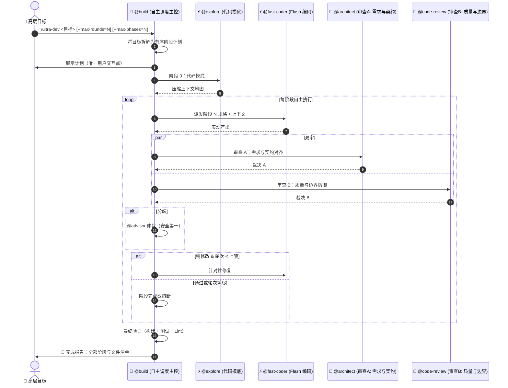
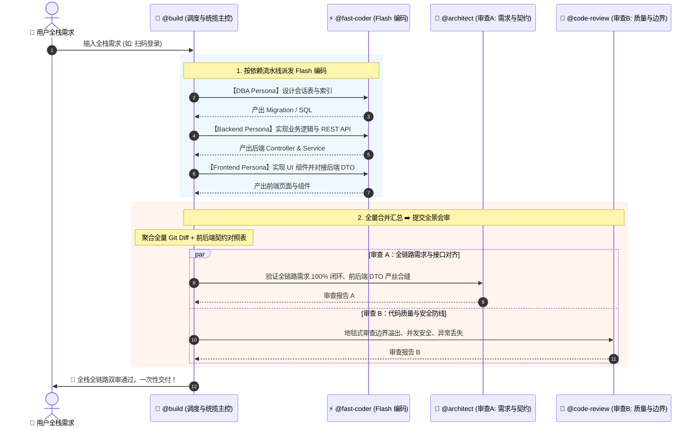

# 四阶闭环开发 (`/quick-dev` & `/fast-dev` & `/deep-dev` & `/ultra-dev`)

四阶闭环开发是 OpenCode 生产级工程化配置中的**核心王牌工作流体系**。

它开创性地采用了 **“Flash 模型极速写码 ➕ 旗舰模型证据驱动严苛审查 ➕ 动态领域灵魂注入 ➕ 争议仲裁共识 ➕ 自主目标驱动多阶段执行”** 的多 Agent 协同架构，构建了从**零审查直通**到**单审敏捷**再到**双审深度**最后到**自主多阶段执行**的四极开发梯队，旨在实现**“开发速度提升 3 倍、Token 成本降低 80%、最终交付代码质量零妥协”**的工程奇迹。

---

## 一、 为什么需要四阶梯队？

传统的 AI 辅助编程通常面临两大痛点：
1. **单次高档出码代价高昂**：直接用旗舰模型写大量样板代码，速度慢、费用极高，且一旦出错重构成本巨大；
2. **单一模型审查存在盲区**：单次生成的代码缺乏对抗性审查，容易产生假实现（Mock）、边界溢出或偷工减料；但在临时脚本或快速试水时，强行走多轮审查又过于繁琐。

四阶体系将**“出码执行（体力活）”**与**“需求质量把关（脑力活）”**彻底解耦，按需分层——从极速直通到自主多阶段执行：

```
                ┌──────────────────────────────────────────────────────────────────────┐
                │                          用户输入业务需求                              │
                └──────────────────────────────────────────────────────────┬───────────┘
                                                                           │
        ┌──────────────────┬───────────────────────┼───────────────────────┬──────────────┐
        │                  │                       │                       │
  ⚡ /quick-dev        🚀 /fast-dev            🧠 /deep-dev            🛸 /ultra-dev
【极速免审直通】      【标准敏捷闭环】        【深度双审共识】        【自主多阶段执行】
【出码即交付】        【日常开发主力】        【核心重器】            【超大型目标】
        │                  │                       │                       │
┌───────┴───────┐  ┌───────┴───────┐       ┌───────┴───────┐       ┌───────┴───────────┐
│• 调度: 原样直通│  │• 调度: 原样直通│       │• 调度: 原样直通│       │• 调度: 目标拆解  │
│• 编码: Flash  │  │• 编码: Flash  │       │• 编码: Flash  │       │• 摸底: @explore  │
│• 审查: 无 (跳过)│ │• 审查: 旗舰单审│      │• 审查 A: 需求对齐│     │• 编码: Flash/阶段│
│• 交付: 即刻交付│  │• 轮次: 最多10轮│      │• 审查 B: 安全防线│     │• 审查: 双审/阶段│
│               │  │• 交付: 单审通过│       │• 仲裁: Advisor│      │• 阶段: 最多 12  │
│               │  │               │       │• 交付: 双审共识│      │• 熔断: 连续 3 阶段│
│               │  │               │       │               │       │  未收敛 → 停机  │
│               │  │               │       │               │       │• 交付: 全阶段完成│
│               │  │               │       │               │       │  + 构建验证     │
└───────────────┘  └───────────────┘       └───────────────┘       └───────────────────┘
```

---

## 二、 四大模式与价值取舍

| 维度 | ⚡ `/quick-dev` (Quick Track) | 🚀 `/fast-dev` (Fast Track) | 🧠 `/deep-dev` (Deep Track) | 🛸 `/ultra-dev` (Ultra Track) |
| :--- | :--- | :--- | :--- | :--- |
| **定位与场景** | 临时脚本、极简改动、样式微调、快速原型、完全人肉把关 | 80% 的日常业务需求、CRUD 接口、前端 UI、单模块重构 | 20% 的核心高危场景：金融支付、核心鉴权、分布式事务、跨端全栈 | **超大型目标**：完整功能系统、多领域项目、端到端实现，横跨多个阶段的复杂交付 |
| **宿主 Agent** | `@build` — 编排零审查快车道 | `@build` — 编排单审闭环 | `@build` — 编排双审 + 仲裁 | `@build` — 编排多阶段自主闭环 |
| **编码 Agent** | `@fast-coder` 派发 | `@fast-coder` 派发 | `@<lang>-dev` 派发（按领域路由） | `@<lang>-dev` 按阶段派发（按领域路由） |
| **审查阵容** | ❌ **无审查（跳过）** | ⚖️ 1 位法官（`@code-review`） | 🏛️ **2 位法官会审（`@architect` ➕ `@code-review`）** | 🏛️ **每阶段双法官会审（`@architect` ➕ `@code-review`）** |
| **分歧对齐** | 无 | 单审直通，逐项整改 | **发生分歧时启动 `@advisor` 辩论仲裁，按安全第一原则形成统一清单** | **每阶段发生分歧时启动 `@advisor` 仲裁，按安全第一原则形成统一清单** |
| **审查标准** | 基础语法正确 | 规范、功能、边界、无 Regression | **顶级需求理解、全链路契约对齐、证据驱动式边界审查、零容忍** | **与 `/deep-dev` 相同的双审标准，按阶段应用 + 跨阶段一致性校验** |
| **收敛轮次** | **1 轮（直通）** | 默认上限 10 轮（通常 2~3 轮收敛） | 默认上限 10 轮（通常 3~5 轮收敛） | **每阶段上限 10 轮，默认 6 个阶段（推荐 3~6；上下文压缩后可达 8~10）** |
| **自主级别** | 无（用户全程驱动） | 低（用户发起，闭环自走） | 低（用户发起，闭环自走） | **高（用户给目标，调度器自主拆解并驱动全部阶段）** |

---

## 三、 动态领域灵魂注入机制 (Dynamic Domain Persona Injection)

很多用户担心：“一个通用的 `@fast-coder`，如何掌握不同领域（前端、Go、Python、DBA）的深层规范？”

系统设计了**动态领域灵魂注入机制**：
1. **无状态容器**：`@fast-coder` 静态绑定各 Profile 中的 Flash/Lite 档模型，保持高吞吐与极速响应；
2. **调度器动态附魔**：调度器 `@build` 识别任务领域后，自动在 Task Prompt 顶部注入该领域的专属工程铁律：
   - **Frontend**：严格 TS 类型（禁 `any`）、Tailwind 原子化、防冗余 Re-render、A11y 无障碍；
   - **Go**：显式 `if err != nil`、`context` 级联传递、Goroutine 防泄漏、禁主流程 panic；
   - **Python**：Pydantic/Type Hints 强类型、`asyncio` 并发、`with` 资源管理、PEP8；
   - **DBA**：索引最左匹配、避免全表锁 Migration、参数化防注入；
3. **支持并行多角色扮演**：由于 Subagent 在底层是独立的会话隔离实例，调度器可以**同时并发派发多个 `@fast-coder`**（一个写前端、一个写后端、一个写 SQL），实现算力最大化利用！

---

## 四、 自主多阶段执行 (`/ultra-dev`)

面对超大型目标——横跨多个领域、需要端到端完整实现的复杂交付，`/ultra-dev` 接收一个高层目标，由调度器自主拆解并驱动全流程到完成：



### 熔断条件（硬性停机）

与 `/deep-dev` 仅在轮次耗尽时熔断不同，`/ultra-dev` 额外配备了自主安全防线：

| 熔断条件 | 原因 |
|---|---|
| **连续 3 个阶段熔断** | 连续三个阶段都达到 max-rounds 未收敛——目标可能过于模糊或方向有误 |
| **业务逻辑分叉且无代码先例** | 需要用户级决策（如“用 JWT 还是 Session”且代码库无先例可循），无法通过读码自行解决 |
| **累计改动文件 > 100** | 防止大规模重构失控的安全护栏 |
| **外部依赖不可用** | 所需的外部服务/API 不可达且无法绕过 |

### `/ultra-dev` vs `/deep-dev` — 该选哪个？

两者都支持多阶段、全栈执行和双审。关键差异在于**自主性和范围**：

| 因素 | `/deep-dev` | `/ultra-dev` |
|---|---|---|
| **输入** | 一个具体的编码任务（如"实现扫码登录：会话表、轮询接口、弹窗"） | 一个高层目标（如"实现完整的用户认证系统"） |
| **拆解** | 调度器在单个审查闭环内编排子任务 | 调度器将目标拆解为独立阶段，每个阶段有自己的审查闭环 |
| **审查范围** | 对完整 diff 做一次双审 | **每个阶段**一次双审，外加跨阶段一致性校验 |
| **用户交互** | 用户发起，闭环自走，用户拿结果 | 用户给目标，确认计划，然后拿结果——中间零交互 |

**选择口诀**：如果你能用一句话描述清楚要做什么 → `/deep-dev`。如果你需要说"实现整个 X 系统"并让 Agent 自己拆解 → `/ultra-dev`。

**实际限制**：`/ultra-dev` 面向 3~6 个阶段的目标。通过上下文压缩（协议 Step 4），可拉伸到 8~10 个阶段。超出 10 个阶段的目标，建议拆分为多次 `/ultra-dev --resume` 运行。

---

## 五、 跨端/全栈复合任务流转 (Full-Stack Orchestration)

面对包含数据库、后端 API、前端界面的复杂全栈需求，`/deep-dev` 具备全生命周期的拆解与汇总能力：



---

## 六、 实战使用与参数指南

### 1. `/quick-dev`（极速免审直通开发）

```bash
# 极速生成脚本或简单改动（跳过一切 AI 审查，出码即交付）
/quick-dev 给代码块右上角添加一键复制按钮与 Toast 提示

# 别名调用（等价）
/flash-dev 修复分页查询页码从 0 开始计算的越界问题
```

### 2. `/fast-dev`（标准敏捷开发）

```bash
# 日常业务与组件开发（1 位旗舰法官严格把关）
/fast-dev 实现用户个人中心头像上传与裁剪组件

# 指定最大轮次
/fast-dev 优化订单查询分页 SQL 并添加联合索引 --max-rounds=5
```

### 3. `/deep-dev`（核心高危与全栈开发）

```bash
# 核心业务重构（启动双旗舰顶级会审 + 争议仲裁）
/deep-dev 重构资金清结算分布式事务与幂等状态机

# 全栈跨端需求（自动拆解 DB ➡️ 后端 ➡️ 前端，全量汇总后双审）
/deep-dev 实现扫码登录全流程：包含登录会话表设计、后端二维码生成与状态轮询接口、前端登录弹窗组件 --max-rounds=10
```

### 4. `/ultra-dev`（自主多阶段执行）

```bash
# 超大型目标——调度器自主拆解并驱动全部阶段到完成
/ultra-dev 实现完整的用户认证系统：包含 OAuth2、会话管理、基于角色的访问控制

# 全栈多领域项目，自定义限制
/ultra-dev 构建实时通知服务：WebSocket 网关、消息队列、客户端 SDK、管理后台 --max-rounds=8 --max-phases=10

# 从中断的会话恢复（读取 .opencode/ultra-dev-state.md）
/ultra-dev --resume
```

---

## 七、 架构防线与收敛保障

1. **Safety-First 原则**：在 `/deep-dev` 和 `/ultra-dev` 中，当 Reviewer A 与 Reviewer B 发生分歧且 `@advisor` 仲裁时，永远遵循**从严不从宽（Safety-First）**原则，宁可多改，不可漏放；
2. **10 轮防死锁熔断**：如果经过 10 轮迭代（`/ultra-dev` 为每阶段 10 轮）仍有未解决的争议点，系统会自动熔断并输出 **《未收敛问题报告》**，列出具体的争议焦点交由人工决策，绝不产生无限死循环；
3. **连续熔断停机**（`/ultra-dev` 专属）：连续 3 个阶段熔断将触发硬性停机——方向可能根本就不对；
4. **阶段数上限护栏**（`/ultra-dev` 专属）：`--max-phases`（默认 6，上限 20）防止无限拆解。推荐 3~6 个阶段；超出 6 需依赖上下文压缩；
5. **上下文压缩**（`/ultra-dev` 专属）：每完成 2 个阶段后，向 `.opencode/ultra-dev-state.md` 写入检查点并丢弃活跃上下文中的详细结果。支持 `--resume` 恢复中断的会话；
6. **每阶段 Diff 隔离**（`/ultra-dev` 专属）：每个阶段独立 git commit，审查者只看当前阶段的 diff（`HEAD~1`），防止跨阶段 diff 膨胀；
7. **零配置侵入**：`tiers.json` 保持干净映射，平滑联动 `/profile` 切换任何模型服务商。
