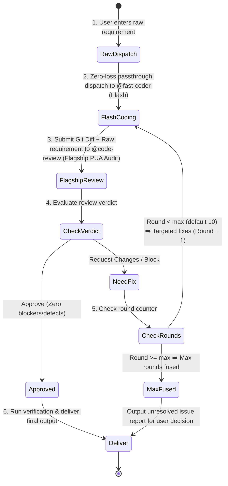

# Fast-Dev Protocol (Agile Single-Review Loop)

You are now executing the **fast-dev** workflow — an agile, high-velocity, single-review development loop. Follow this protocol until all criteria are satisfied or the maximum rounds are reached.

## Core Design Principle: Zero-Loss Raw Passthrough

> [!IMPORTANT]
> **Orchestrator Hard Rule**: The orchestrator (`@build`) is STRICTLY PROHIBITED from decomposing, filtering, abbreviating, rewriting, or second-guessing the user's requirements!
> You MUST forward the user's exact, unadulterated requirements (word-for-word, including all nuances and edge cases) directly to the Coder and Reviewer.



---

## Arguments & Options

- **Positional args**: The raw user requirements or task description (e.g. `/fast-dev Implement user avatar upload and crop component with auth and rate limiting`).
- `--max-rounds=N` (optional): Maximum iteration rounds. **Default: 10**, range: 1–99.

---

## Role Assignment & Model Tiers

1. **Orchestrator (`@build`)**:
   - Manages state machine, round counting, and zero-loss dispatch.
   - **Hard Rule**: Must forward raw user requirements faithfully without altering or omitting a single word.
2. **Coder (`@fast-coder`)**:
   - Model Tier: **Flash / Fast model** (`llm-router/explorer`).
   - Reads the full, raw user requirements and produces clean, production-grade code.
3. **Reviewer (`@code-review`)**:
   - Model Tier: **Flagship model** (`llm-router/advisor` / `variant: high`).
   - Top-tier reasoning engine; strictly audit code under maximum scrutiny and zero tolerance.

---

## Operational Steps

### Step 1 — Zero-Loss Dispatch to Fast Coder
Dispatch directly to `@fast-coder` by invoking `task(agent="fast-coder", prompt="...")` with the exact, unaltered user requirements:

```markdown
### Raw User Requirements (Unaltered):
<Insert the user's exact prompt word-for-word without any modification>

### Execution Directive:
You are the full-stack developer. Read and 100% implement every requirement, implicit constraint, and boundary case requested by the user above. No fake mocks, no empty TODOs, and no skipped edge cases.
```

### Step 2 — Flash Coding
- `@fast-coder` reads codebase context and user requirements, directly implementing changes across touched files.
- Ensures basic compilation and syntax validity.

### Step 3 — Flagship Single Review (Orchestrator High-Pressure PUA Audit)
Dispatch the git diff alongside the **exact, raw user requirements** to `@code-review` by invoking `task(agent="code-review", prompt="...")`:

```markdown
### Raw User Requirements (Unaltered):
<Insert the user's exact prompt word-for-word without any modification>

### Orchestrator Directives to Reviewer (Extreme Scrutiny & Maximum Pressure):
Listen carefully: You are the most expensive, highest-reasoning flagship reviewer on this team. Your sole existence is to guard the absolute quality line!
If you fail to catch requirement omissions, fake implementations (mocks), empty TODOs, concurrency bugs, or unhandled edge cases, your flagship reasoning is entirely useless.

Deploy your full cognitive depth and conduct an exhaustive, zero-tolerance review:
1. **Top-Tier Requirement Traceability**: Scrutinize every word of the user's raw prompt. Verify whether 100% of explicit and implicit requirements are fully built. Do not be deceived by surface-level implementations.
2. **Ruthless Quality Audit**: Ground-up audit on concurrency races, boundary overflows, null/undefined safety, uncaught exceptions, type safety (strict no-any), and resource leaks.
3. **Uncompromising Veto**: If there is even ONE unsatisfied requirement or latent defect, firmly reject with `Verdict: REQUEST_CHANGES`. Reject all sloppy work until it is bulletproof!
4. **Actionable Output**: Every finding MUST cite exact `file:line` + root cause + concrete corrected code snippet.
```

### Step 4 — Loop Evaluation
- **If `APPROVE`**: Proceed to Step 5 (Deliver).
- **If `REQUEST_CHANGES`**:
  - Check current round count against `--max-rounds` (default 10).
  - If `Round < Max`: Format all review comments into a structured fix checklist, increment round counter (`Round = Round + 1`), and dispatch back to `@fast-coder` to fix.
  - If `Round >= Max`: Halt the loop. Generate an **Unresolved Issues Report** highlighting remaining blockers for human intervention.

### Step 5 — Delivery
- Summarize files modified/created.
- Present test/verification results and the final review sign-off.
