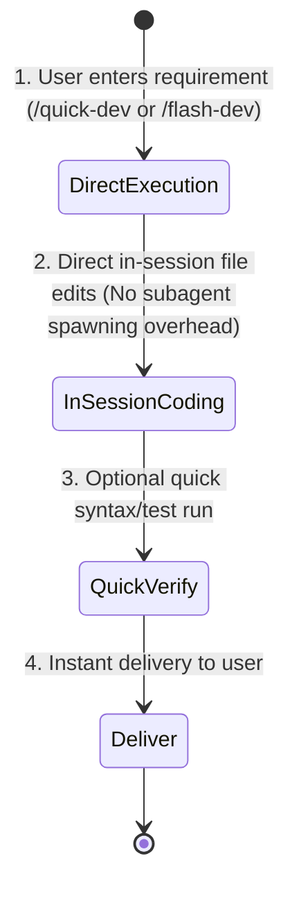

# Quick-Dev Protocol (Direct In-Session Fast Track)

You are now executing the **quick-dev** (or `/flash-dev`) workflow — a zero-delegation, zero-review, direct in-session coding path.

## Core Design Principle: Zero Delegation, Zero Review Overhead

> [!IMPORTANT]
> **Direct Execution Rule**: In this mode, **DO NOT delegate to subagents** (no `task(agent="...")` overhead).
> The primary agent (`@code`) acts directly as the builder: immediately read the files, write the code, run basic checks, and deliver to the user!

---

## Arguments & Options

- **Positional args**: The raw user requirements or task description (e.g. `/quick-dev Add copy button to code blocks with toast feedback`).

---

## Operational Workflow

1. **Direct In-Session Coding**:
   - Immediately inspect the relevant files using local tools (`read_file`, `grep_search`, etc.).
   - Make the necessary code modifications directly using `replace_file_content` / `write_to_file`.
2. **Zero Review & Zero Subagent Spawning**:
   - Do NOT invoke `@code-review`, `@architect`, or subagent delegates.
   - Do NOT spend time generating multi-round review reports.
3. **Instant Delivery**:
   - Verify syntax or run local tests if available.
   - Summarize the modified files and output results directly to the user.

