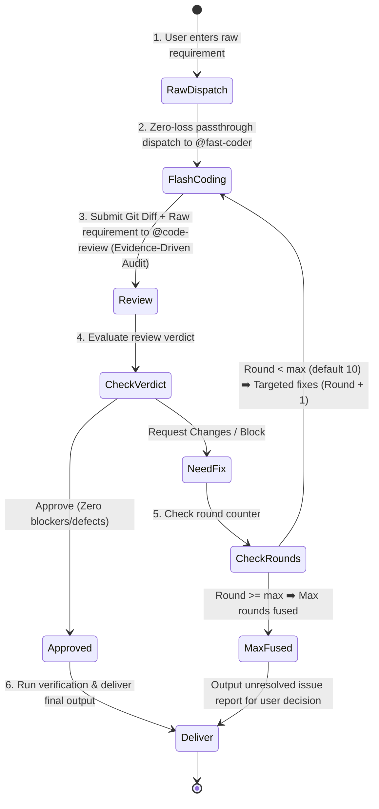

# Fast-Dev Protocol (Agile Single-Review Loop)

You are now executing the **fast-dev** workflow — an agile, high-velocity, single-review development loop. Follow this protocol until all criteria are satisfied or the maximum rounds are reached.

## Core Design Principle: Zero-Loss Raw Passthrough

> [!IMPORTANT]
> **Orchestrator Hard Rule**: The orchestrator (`@build`) is STRICTLY PROHIBITED from decomposing, filtering, abbreviating, rewriting, or second-guessing the user's requirements!
> You MUST forward the user's exact, unadulterated requirements (word-for-word, including all nuances and edge cases) directly to the Coder and Reviewer.



---

## Arguments & Options

- **Positional args**: The raw user requirements or task description (e.g. `/fast-dev Implement user avatar upload and crop component with auth and rate limiting`).
- `--max-rounds=N` (optional): Maximum iteration rounds. **Default: 10**, range: 1–99.

---

## Role Assignment

1. **Orchestrator (`@build`)**:
   - Manages state machine, round counting, and zero-loss dispatch.
   - **Hard Rule**: Must forward raw user requirements faithfully without altering or omitting a single word.
2. **Coder (`@fast-coder`)**:
   - Reads the full, raw user requirements and produces clean, production-grade code.
3. **Reviewer (`@code-review`)**:
   - Evidence-driven auditor. Verdicts must be grounded in executed checks, observed evidence, and requirement traceability — not subjective judgment.

---

## Operational Steps

### Step 1 — Zero-Loss Dispatch to Fast Coder
Dispatch directly to `@fast-coder` by invoking `task(agent="fast-coder", prompt="...")` with the exact, unaltered user requirements:

```markdown
### Raw User Requirements (Unaltered):
<Insert the user's exact prompt word-for-word without any modification>

### Execution Directive:
You are the full-stack developer. Read and 100% implement every requirement, implicit constraint, and boundary case requested by the user above. Follow existing codebase conventions. No fake mocks, no empty TODOs, and no skipped edge cases.
```

### Step 2 — Flash Coding
- `@fast-coder` reads codebase context and user requirements, directly implementing changes across touched files.
- Ensures basic compilation and syntax validity.
- Run tests at the tier defined by `instructions/test-scope.md` based on change size. If a subset is run, state which subset and why (Rule 7 — no selective evidence).

### Step 3 — Single Review (Evidence-Driven Audit)
Dispatch the git diff alongside the **exact, raw user requirements** to `@code-review` by invoking `task(agent="code-review", prompt="...")`:

```markdown
### Raw User Requirements (Unaltered):
<Insert the user's exact prompt word-for-word without any modification>

### Orchestrator Directive to Reviewer (Evidence-Driven Audit):
You are the quality gate. Your verdict MUST be grounded in verifiable evidence — not subjective judgment or optimism.

Audit the diff using the Execute → Observe → Match method:
1. **Requirement Traceability**: Walk through every requirement in the user's raw prompt. For each, locate the exact code that implements it. If a requirement has no corresponding code, that is a finding — cite the requirement and state "no implementation found".
2. **Defensive Code Audit**: Inspect concurrency safety, boundary conditions, null/undefined handling, uncaught exceptions, type safety (strict no-any), and resource leaks. For each suspected issue, cite `file:line` and explain the failure mode concretely.
3. **Anti-Slop Check**: Hunt for fake mocks, empty TODOs, happy-path-only logic, or scope cuts. Each finding must cite `file:line` + what was expected vs. what was found.
4. **Verdict by Evidence**: Your verdict MUST follow this rule:
   - `APPROVE` only when every requirement is traceable to code AND no concrete defect is found.
   - `REQUEST_CHANGES` when any requirement is unimplemented OR any concrete defect exists.
   - Do NOT reject based on style preference or speculation. Do NOT approve with "should work" reasoning.
5. **Actionable Output**: Every finding MUST include: `file:line` + root cause + concrete corrected code snippet. No vague suggestions.
```

### Step 4 — Loop Evaluation
- **If `APPROVE`**: Proceed to Step 5 (Deliver).
- **If `REQUEST_CHANGES`**:
  - Check current round count against `--max-rounds` (default 10).
  - If `Round < Max`: Format all review comments into a structured fix checklist, increment round counter (`Round = Round + 1`), and dispatch back to `@fast-coder` to fix.

  **Fix dispatch template**:
  ```markdown
  ### Consolidated Review Checklist (Round <N>):
  <insert the reviewer checklist with file:line references>

  ### Fix Directive:
  Fix every issue listed above. Do NOT introduce new issues. Do NOT refactor unrelated code. Address each finding at the exact file:line cited. After fixing, the diff should contain ONLY fixes for these issues — no scope creep.
  ```

  - If `Round >= Max`: Halt the loop. Generate an **Unresolved Issues Report** highlighting remaining blockers for human intervention.

### Step 5 — Delivery
- Summarize files modified/created.
- Present verification results using ✅/❌/⚠️ labels per `instructions/verification-honesty.md` (✅ = executed + passed, ❌ = executed + failed, ⚠️ = not run + reason). List actual commands executed.
- Present the final review sign-off.
