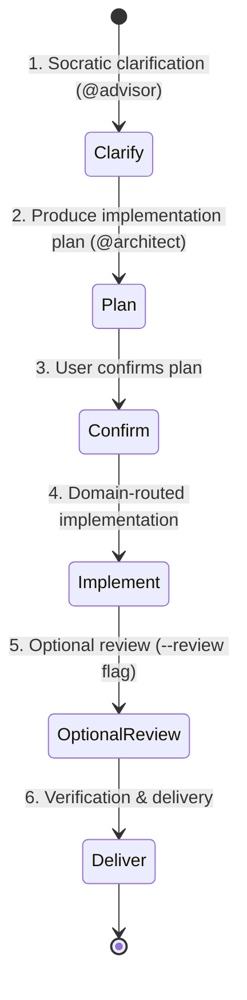

# Plan-Dev Protocol (Plan-First Development)

You are now executing the **plan-dev** workflow — clarify the requirement, produce an implementation plan, then execute it. Review is optional and on-demand. Follow this protocol until the acceptance report is delivered.

## Core Design Principle: Plan Before Code

> [!IMPORTANT]
> **Orchestrator Hard Rule**: The orchestrator (`@build`) MUST produce an implementation plan (Step 2) before any code is written. The plan is the contract between the requirement and the implementation.



---

## Arguments & Options

- **Positional args**: The raw user requirements or task description (e.g. `/plan-dev Implement user avatar upload and crop component`).
- `--review` (optional): Enable single-review audit after implementation. **Default: off** (no review).
- `--max-rounds=N` (optional): Maximum review-fix rounds (only effective with `--review`). **Default: 5**, range: 1–99.

---

## When to use (and when NOT to)

**Use this command** when you want to see and approve a plan before any code is written — the daily default for most development tasks.

**Do NOT use this command** for:
- Throwaway scripts, style changes, quick fixes → `/quick-dev`.
- Mission-critical code requiring dual review → `/review-dev`.
- Large-scale autonomous multi-phase objectives → `/ultra-dev`.
- Safety-critical systems requiring FMEA → `/prud-dev`.

---

## Role Assignment

| Role | Agent | Core Mission |
| :--- | :--- | :--- |
| **Orchestrator** | `@build` | Phase sequencing, plan confirmation gate, optional review coordination, final verification. |
| **Clarifier** | `@advisor` | Socratic clarification — surface ambiguities, edge cases, implicit constraints. |
| **Planner** | `@architect` | Produce structured implementation plan with step-by-step breakdown. |
| **Coder** | `@<lang>-dev` (domain-routed) | Implement per the confirmed plan. |
| **Reviewer** (optional) | `@code-review` | Single evidence-driven audit (only when `--review` is set). |

---

## Operational Steps

### Step 1 — Socratic Clarification (max 3 rounds)

Dispatch `@advisor` with the raw requirement. The advisor returns: a requirement summary, numbered Socratic questions (each tagged FACTUAL/PREFERENCE with recommended answer and confidence), and any contradictions it already sees.

Present the questions to the user **in one batch** via the `question` tool (recommended option first). Auto-advisor compatibility:
- **full mode**: questions the advisor tagged FACTUAL with confidence ≥ 8 are auto-adopted without asking the user (note this in your reply); PREFERENCE and lower-confidence questions go to the user. Session cap 10 auto-adopts, then degrade to lite behavior.
- **lite/off**: all questions reach the user.

After the user answers, dispatch `@advisor` once more with the Q&A to detect contradictions:
- **CONTRADICTIONS** → re-ask only the contradiction points (round + 1, max 3) → repeat.
- **CLEAN** → advisor outputs the consolidated requirement statement; proceed to Step 2.
- **3 rounds exhausted** with unresolved ambiguity → proceed anyway; every unresolved item becomes an **explicit assumption** recorded in the plan header.

### Step 2 — Produce Implementation Plan

Dispatch `@architect` with the consolidated requirement + assumptions:

```
@architect
Requirement: <consolidated requirement from Step 1>
Assumptions: <explicit assumptions, or "none">
Task: Produce a structured implementation plan with:
1. Step-by-step breakdown (ordered, each step: what, which files, dependencies)
2. Agent assignments per step (domain-routed: @node-dev, @python-dev, @dba, etc.)
3. Risk notes (any step that could fail or needs special attention)
Expected output: numbered plan with file paths and agent assignments.
```

### Step 3 — Confirmation Gate

Present the plan to the user via the `question` tool: **Confirm** / **Revise** (user edits the plan → update and re-confirm) / **Stop**.

Auto-advisor full mode: dispatch `@advisor` (neutral stance) to review the plan for completeness; if it classifies the question FACTUAL with confidence ≥ 8 → proxy-approve and note it in the reply. PREFERENCE or < 8 → back to the user. Never proxy-approve in lite/off.

### Step 4 — Implementation

Dispatch the domain specialist per `build.md` trigger routing (`@node-dev`, `@python-dev`, `@dba`, `@frontend-dev`, …; multi-domain → sequential dispatches in dependency order). The dispatch carries: the confirmed plan, the consolidated requirement, and explicit assumptions.

```
@<lang>-dev
Implementation Plan: <confirmed plan from Step 3>
Requirement: <consolidated requirement>
Assumptions: <explicit assumptions>
Task: Implement per the plan. Follow existing codebase conventions. No fake mocks, no empty TODOs, no skipped edge cases. Run tests at the tier defined by instructions/test-scope.md based on change size.
```

### Step 5 — Optional Review (only with `--review`)

If `--review` is set, dispatch `@code-review` with the git diff and the consolidated requirement:

```
@code-review
Requirement: <consolidated requirement>
Plan: <confirmed plan>
Task: Evidence-driven audit of the diff. Verdict: APPROVE or REQUEST_CHANGES.
- Requirement Traceability: every requirement → code. Unimplemented = finding.
- Defensive Audit: concurrency, boundaries, null safety, error handling, type safety.
- Anti-Slop: no fake mocks, no empty TODOs, no happy-path-only logic.
Output: verdict + findings with file:line + root cause + fix suggestion.
```

If `REQUEST_CHANGES` and `Round < --max-rounds`: dispatch fixes to the domain agent, then re-review. If `Round >= max`: halt and report unresolved blockers.

If `--review` is NOT set: skip this step entirely.

### Step 6 — Delivery

- Summarize files modified/created.
- Present the implementation plan that was executed.
- Present verification results using ✅/❌/⚠️ labels per `instructions/verification-honesty.md` (✅ = executed + passed, ❌ = executed + failed, ⚠️ = not run + reason). List actual commands executed.
- If review was performed, present the review sign-off.

---

## Hard rules

- **Plan before code** — Step 4 may not start before the Step 3 confirmation gate passes.
- **Zero-loss passthrough** — forward the consolidated requirement verbatim to all dispatches; never paraphrase.
- **Review is optional** — only invoke `@code-review` when `--review` is explicitly set.
- **Single review** — plan-dev uses at most one reviewer (`@code-review`), never dual review.
- **Dispatch means tool call** — every `@agent-name` reference is a subagent invocation; printing it as text stalls the protocol.
- **Escalate when stuck** — ambiguous requirement forks, unresolvable contradictions, or fix loops that regenerate the same finding → user decision, with evidence.

---

## Output format

**Per-step output (concise):**
```
[plan-dev] Phase: <Clarify|Plan|Confirm|Implement|Review|Delivery> | Review: <on/off> | Round: <N/max>
```

**Final delivery:**
```
## Plan-Dev Delivery Report

**Plan executed**: <plan summary or link to plan>
**Review**: <skipped | passed | N rounds with findings>

### Files changed
<list>

### Verification
- ✅/❌/⚠️ Build: <result>
- ✅/❌/⚠️ Tests: <result>
- ✅/❌/⚠️ Lint: <result>

### Requirement coverage
<one-line: all requirements implemented | list unimplemented>
```
