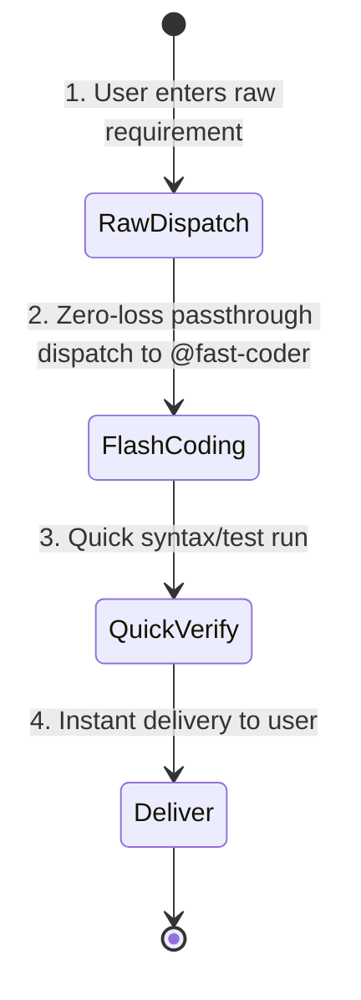

# Quick-Dev Protocol (Zero-Review Fast Track)

You are now executing the **quick-dev** (or `/flash-dev`) workflow — a zero-review, fast-track development path. It uses the same zero-loss dispatch as `/fast-dev` but skips the review loop entirely for instant delivery.

## Core Design Principle: Zero-Loss Raw Passthrough, Zero Review

> [!IMPORTANT]
> **Orchestrator Hard Rule**: The orchestrator (`@build`) is STRICTLY PROHIBITED from decomposing, filtering, abbreviating, rewriting, or second-guessing the user's requirements!
> You MUST forward the user's exact, unadulterated requirements (word-for-word, including all nuances and edge cases) directly to the Coder.



---

## Arguments & Options

- **Positional args**: The raw user requirements or task description (e.g. `/quick-dev Add copy button to code blocks with toast feedback`).

---

## Role Assignment

1. **Orchestrator (`@build`)**:
   - Manages zero-loss dispatch to the coder.
   - **Hard Rule**: Must forward raw user requirements faithfully without altering or omitting a single word.
2. **Coder (`@fast-coder`)**:
   - Reads the full, raw user requirements and produces clean, production-grade code.

---

## Operational Steps

### Step 1 — Zero-Loss Dispatch to Fast Coder
Dispatch directly to `@fast-coder` by invoking `task(agent="fast-coder", prompt="...")` with the exact, unaltered user requirements:

```markdown
### Raw User Requirements (Unaltered):
<Insert the user's exact prompt word-for-word without any modification>

### Execution Directive:
You are the full-stack developer. Read and 100% implement every requirement, implicit constraint, and boundary case requested by the user above. Follow existing codebase conventions. No fake mocks, no empty TODOs, and no skipped edge cases.
```

### Step 2 — Flash Coding
- `@fast-coder` reads codebase context and user requirements, directly implementing changes across touched files.
- Ensures basic compilation and syntax validity.

### Step 3 — Quick Verify
- Run tests at the tier defined by `instructions/test-scope.md` based on change size. If a subset is run, state which subset and why the rest were excluded (Rule 7 — no selective evidence).
- Do NOT invoke `@code-review`, `@architect`, or any review subagent.
- Do NOT spend time generating multi-round review reports.

### Step 4 — Delivery
- Summarize files modified/created.
- Present verification results using ✅/❌/⚠️ labels per `instructions/verification-honesty.md` (✅ = executed + passed, ❌ = executed + failed, ⚠️ = not run + reason). List actual commands executed.
