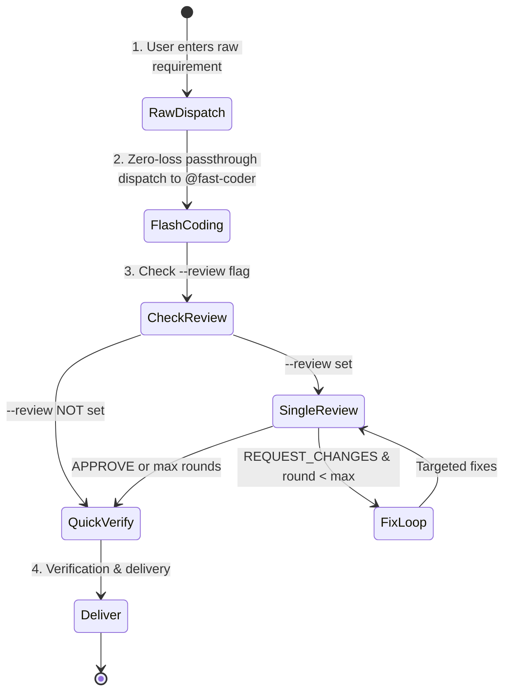

# Quick-Dev Protocol (Zero-Review Fast Track, Optional Review)

You are now executing the **quick-dev** (or `/flash-dev`) workflow — a zero-review, fast-track development path. By default it skips the review loop entirely for instant delivery. With `--review`, a single evidence-driven audit is performed after implementation.

## Core Design Principle: Zero-Loss Raw Passthrough, Review Optional

> [!IMPORTANT]
> **Orchestrator Hard Rule**: The orchestrator (`@build`) is STRICTLY PROHIBITED from decomposing, filtering, abbreviating, rewriting, or second-guessing the user's requirements!
> You MUST forward the user's exact, unadulterated requirements (word-for-word, including all nuances and edge cases) directly to the Coder.



---

## Arguments & Options

- **Positional args**: The raw user requirements or task description (e.g. `/quick-dev Add copy button to code blocks with toast feedback`).
- `--review` (optional): Enable single-review audit after implementation. **Default: off** (no review).
- `--max-rounds=N` (optional): Maximum review-fix rounds (only effective with `--review`). **Default: 3**, range: 1–99.

---

## When to use (and when NOT to)

**Use this command** for low-stakes work where the cheapest path and its quality tradeoff are acceptable: throwaway scripts, style changes, UI tweaks, quick prototypes. The coder is `@fast-coder` — flash tier, cheaper than even the default agent path.

**Do NOT use this command** for:
- Zero ceremony at full quality → skip workflows entirely: ask directly (default `lite` escalates to `@code`, pro tier).
- A plan to approve before code → `/plan-dev`.
- Dual review / mission-critical → `/review-dev`; safety-critical (FMEA) → `/prud-dev`; autonomous multi-phase → `/ultra-dev`.

Clear mismatch in the invocation (payments, auth, migrations through `/quick-dev`)? Note it and suggest the stronger flow in your opening line — then proceed as invoked; never stall the fast track.

---

## Role Assignment

1. **Orchestrator (`@build`)**:
   - Manages zero-loss dispatch to the coder.
   - **Hard Rule**: Must forward raw user requirements faithfully without altering or omitting a single word.
2. **Coder (`@fast-coder`)**:
   - Reads the full, raw user requirements and produces clean, production-grade code.
3. **Reviewer (optional)** (`@code-review`):
   - Evidence-driven auditor — only invoked when `--review` is set.

---

## Operational Steps

### Step 1 — Zero-Loss Dispatch to Fast Coder
Dispatch directly to `@fast-coder` by invoking `task(agent="fast-coder", prompt="...")` with the exact, unaltered user requirements:

```markdown
### Raw User Requirements (Unaltered):
<Insert the user's exact prompt word-for-word without any modification>

### Execution Directive:
You are the full-stack developer. Read and 100% implement every requirement, implicit constraint, and boundary case requested by the user above. Follow existing codebase conventions. No fake mocks, no empty TODOs, and no skipped edge cases.
```

### Step 2 — Flash Coding
- `@fast-coder` reads codebase context and user requirements, directly implementing changes across touched files.
- Ensures basic compilation and syntax validity.

### Step 3 — Optional Review (only with `--review`)

If `--review` is set, dispatch `@code-review` with the git diff and the raw user requirements:

```markdown
### Raw User Requirements (Unaltered):
<Insert the user's exact prompt word-for-word without any modification>

### Orchestrator Directive to Reviewer (Evidence-Driven Audit):
You are the quality gate. Your verdict MUST be grounded in verifiable evidence — not subjective judgment or optimism.

Audit the diff using the Execute → Observe → Match method:
1. **Requirement Traceability**: Walk through every requirement in the user's raw prompt. For each, locate the exact code that implements it. If a requirement has no corresponding code, that is a finding — cite the requirement and state "no implementation found".
2. **Defensive Code Audit**: Inspect concurrency safety, boundary conditions, null/undefined handling, uncaught exceptions, type safety (strict no-any), and resource leaks. For each suspected issue, cite `file:line` and explain the failure mode concretely.
3. **Anti-Slop Check**: Hunt for fake mocks, empty TODOs, happy-path-only logic, or scope cuts. Each finding must cite `file:line` + what was expected vs. what was found.
4. **Verdict by Evidence**: Your verdict MUST follow this rule:
   - `APPROVE` only when every requirement is traceable to code AND no concrete defect is found.
   - `REQUEST_CHANGES` when any requirement is unimplemented OR any concrete defect exists.
   - Do NOT reject based on style preference or speculation. Do NOT approve with "should work" reasoning.
5. **Actionable Output**: Every finding MUST include: `file:line` + root cause + concrete corrected code snippet. No vague suggestions.
```

- **If `APPROVE`**: Proceed to Step 4.
- **If `REQUEST_CHANGES`**:
  - Check current round against `--max-rounds` (default 3).
  - If `Round < Max`: Format review comments into a structured fix checklist, increment round counter, dispatch back to `@fast-coder` to fix.
  - If `Round >= Max`: Halt review loop, proceed to Step 4 with unresolved issues noted.

If `--review` is NOT set: skip this step entirely.

### Step 4 — Quick Verify & Delivery
- Run tests at the tier defined by `instructions/test-scope.md` based on change size. If a subset is run, state which subset and why the rest were excluded (Rule 7 — no selective evidence).
- Summarize files modified/created.
- Present verification results using ✅/❌/⚠️ labels per `instructions/verification-honesty.md` (✅ = executed + passed, ❌ = executed + failed, ⚠️ = not run + reason). List actual commands executed.
- If review was performed, present the review sign-off (or unresolved issues if max rounds reached).

---

## Hard rules

- **Review is optional** — only invoke `@code-review` when `--review` is explicitly set.
- **Single review** — quick-dev uses at most one reviewer (`@code-review`), never dual review.
- **Dispatch means tool call** — every `@agent-name` reference is a subagent invocation; printing it as text stalls the protocol.
- **Escalate when stuck** — fix loops that regenerate the same finding → user decision, with evidence.
